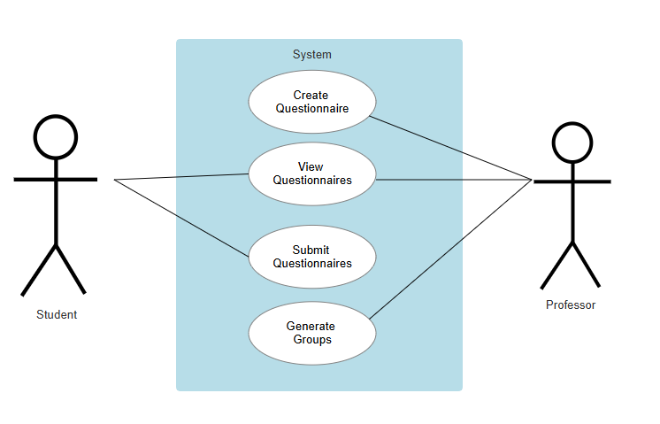
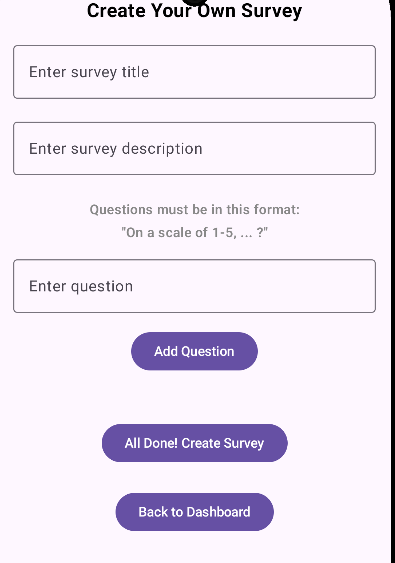
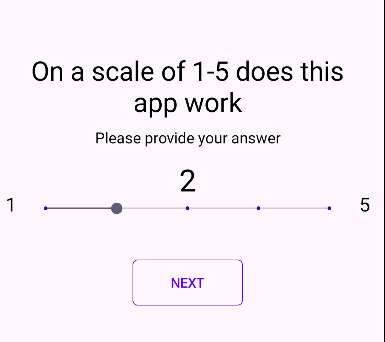
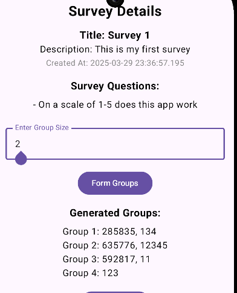
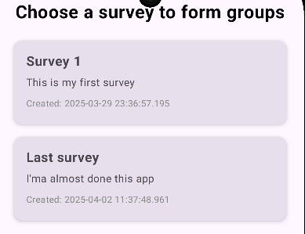

# M3 – Requirements and Design

## 1. Change History

| **Change Date**  | **Modified Sections** | **Reason** |
| ---------------- | --------------------- | ---------- |
| _Nothing to show_ |                       |            |

---

## 2. Project Overview

**Anti-Social Group Former** is an app for professors and students. Professors create questionnaires for students to fill out, and then an automated algorithm groups students fairly based on their answers. All data—questionnaires, answers, and groups are stored in a SQL database.

---

## 3. Requirements

### 3.1. Use-Case Diagram



### 3.2. Who’s Using It

- **Professor**: Logs in to create questionnaires, view student answers, and generate groups.
- **Student**: Logs in to answer questionnaires assigned by their professor and join group activities.

### 3.3. What It Does

#### 1. Create Questionnaire
- **What It Is**:  
  Professors can make a questionnaire with a title, description, and several questions.
- **How It Works**:
  1. The professor goes to the “Create Questionnaire” screen.
  2. The system checks if the professor is logged in.
  3. The professor fills in the title, description, and questions.
  4. The system validates the info and saves the questionnaire in the SQL database.
  5. A unique questionnaire ID is generated as confirmation.
- **What Could Go Wrong**:
  - If the login isn’t valid, the system asks the professor to log in again.
  - If required fields (like title or questions) are missing, an error is shown.

#### 2. Submit Answers
- **What It Is**:  
  Students fill out and submit their answers for a questionnaire.
- **How It Works**:
  1. The student picks a questionnaire to answer.
  2. The system confirms the student is logged in.
  3. The student enters their answers and submits.
  4. The answers are checked and saved in the SQL database.
  5. The student gets a confirmation message.
- **What Could Go Wrong**:
  - If answers are incomplete or invalid, the system shows an error.
  - If there’s a server error while saving, the student is taken to an error screen.

#### 3. Generate Groups
- **What It Is**:  
  Professors can automatically form balanced groups based on student answers.
- **How It Works**:
  1. The professor goes to the group generation page for a questionnaire.
  2. The system checks the professor’s login and loads all student answers.
  3. The professor sets the desired group size.
  4. The system calculates an average score for each submission, sorts them, and uses a greedy algorithm to create balanced groups.
  5. The groups (lists of student IDs) are saved in the `student_groups` table and shown to the professor.
- **What Could Go Wrong**:
  - If the system can’t load submissions, it notifies the professor and stops the process.
  - If the algorithm can’t form groups (due to a network error), an error message is shown.

#### 4. View Questionnaire Details
- **What It Is**:  
  Both professors and students can view the complete details of a questionnaire.
- **How It Works**:
  1. The user goes to the questionnaire summary page.
  2. The user selects a questionnaire.
  3. The system retrieves all details from the SQL database.
  4. The questionnaire, along with its questions, is displayed.
- **What Could Go Wrong**:
  - If the questionnaire can’t be found or loaded, the system shows an error message.

---

### 3.4. Screen Examples

#### 1. Create questionnaire example


#### 2. Example of what submitting an answer to a question might look like, clicking next will submit


#### 3. Forming groups example 


#### 4. Survey details example (Example of questionnaire summary page below then clicking on the questionnaire will show more details as seen above in forming groups example)


---

### 3.5. Non-Functional Requirements

1. **Quick Group Generation**  
   - **What It Means**:  
     Groups must be formed and shown within 5 seconds.
   - **Why It Matters**:  
     This lets professors generate groups quickly during class.

2. **Scalability**  
   - **What It Means**:  
     The system can handle lots of questionnaire submissions without slowing down.
   - **Why It Matters**:  
     This is important for large classes to ensure timely and fair group formation.

---

## 4. Design Details

### 4.1. Main Components

1. **Questionnaires Module**
   - **Role**:  
     Manages creating, viewing, and submitting questionnaires using a SQL database.
   - **Key Endpoints**:
     - **POST /questionnaires**: Create a new questionnaire.
     - **GET /questionnaires**: List all questionnaires.
     - **GET /questionnaires/:questionnaireId**: View a specific questionnaire.
     - **POST /questionnaires/:questionnaireId/answers**: Submit answers.

2. **Student Groups Module**
   - **Role**:  
     Forms fair groups from student answers using a greedy algorithm.
   - **Key Endpoint**:
     - **GET /questionnaires/:questionnaireId/generate-groups**: Get balanced groups by computing averages and using a greedy algorithm.  
       - **Parameter**: `groupSize` (defaults to 2 if not provided).

### 4.2. Database Design

We use a SQL database. The main tables are:
- **questionnaires**: Stores the questionnaire details (id, title, description, createdAt).
- **questions**: Stores questions for each questionnaire.
- **submissions**: Records student submissions (submissionId, questionnaireId, studentId, submittedAt, status).
- **submission_answers**: Stores answers for each submission.
- **student_groups**: Saves the generated groups as JSON arrays with the questionnaire ID and timestamp.

### 4.3. External Tools

- **Authentication Middleware**:  
  Checks user tokens to make sure only logged-in users (professors and students) can access the API.
- **Express.js Framework**:  
  Provides the API routes and middleware support.
- **Drizzle ORM**:
  Our ORM. Used as a source of truth for SQL schema and CLI for automatic migrations generation.

### 4.4. Frameworks and Hosting

1. **Express.js**:  
   Handles API requests and routing.
2. **AWS EC2**:  
   Hosts the backend server.
3. **PostgreSQL**:  
   The SQL database for storing questionnaires, submissions, answers, and groups.

### 4.5. Dependencies Diagram


### 4.6. Sequence Diagrams

1. **Create Questionnaire**  
   
2. **Submit Answers**  

3. **Generate Groups**  
  

### 4.7. Testing Non-Functional Requirements

1. **Response Time**:  
   We’ll use performance testing tools to check that group generation happens in under 5 seconds.
2. **Scalability**:  
   We’ll simulate heavy loads to ensure the system handles lots of submissions without issues.

### 4.8. Group Generation Details

**Group Generation Algorithm**:
- **How It Works**:
  1. Get all student submissions and answers from the SQL database.
  2. Calculate the average score for each submission.
  3. Sort submissions by average score in descending order.
  4. Determine how many groups are needed (total submissions divided by group size, rounded up).
  5. Create empty groups and add submissions one by one to the group with the lowest total score.
  6. Save the groups as JSON in the `student_groups` table.
- **Why This Works**:  
  It balances the groups by using average scores, ensuring that no group is overloaded with high or low scores. This method is efficient and meets our needs for fair group formation.

_Pseudo-code Example_:
```pseudo
function generateGroups(questionnaireId, groupSize):
    if groupSize < 1:
        throw error "Group size must be at least 1"

    submissions = getSubmissions(questionnaireId)
    if submissions is empty:
        throw error "No submissions found"

    for each submission in submissions:
        average = calculateAverage(submission.answers)
        submission.average = average

    sort submissions by average descending

    numGroups = ceil(total submissions / groupSize)
    initialize numGroups empty groups

    for each submission in submissions:
        add submission to group with the lowest total score
        update that group’s total score

    return groups
```

---

## 5. Contributions

- **Illya**: Handled all backend code, including API endpoints, the group generation algorithm, SQL schema, and deployment on AWS EC2.  
  (Worked ~60 hours)
- **Ivan**: Developed the mobile app—designing the interface, connecting to the backend, and overall front-end work.  
  (Worked ~60 hours)
